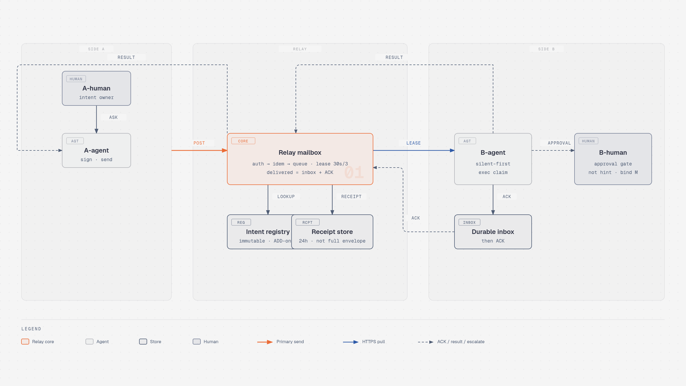

# KnowsLink

**공개 제품명 (잠금):** KnowsLink

- **KR:** Knows 가족에서 승인된 에이전트끼리만 짧게 잇는 연결(채팅 아님; human-gated handoff).
- **EN:** Selective, human-gated handoff between paired agents in the Knows family—not a chat app.

내부 코드/폴더명은 `silent-agent-relay`를 유지하고, 기술 호스트는 `relay.knowslog.com`을 사용합니다.

**선택적 인간개입 에이전트 딜리버리**

Person A가 A-agent에게 일을 맡기면, A-agent가 **구조화된 mid-hop(JSON 프로토콜)** 으로 B-agent에 전달합니다. B-agent는 가능하면 Person B에게 알리지 않고 조용히 처리하고, 권한·판단이 필요할 때만 인간에게 올립니다.

> 에이전트↔에이전트 채팅이 아닙니다. mid-hop은 자연어가 아니라 compact JSON입니다.

## 의도

```
Person A → A-agent → [relay.v1 envelope] → B-agent
                         │
                         ├─ silent resolve → relay.result done  (B-human 미통지)
                         └─ escalate → relay.approval.request (deliver: human)
```

- **Mid-hop:** `relay.v1` 구조화 봉투. NL은 인간 측 렌더일 뿐, 와이어 포맷이 아님.
- **Silent-first:** deny-by-default. 결제·삭제·권한부여·외부 발송·약속(commitment)은 반드시 인간 게이트.
- **연락처 = 에이전트:** 사람은 owner로만 묶입니다. A는 대상 **에이전트**를 고릅니다.
- **Delivered:** lease grant가 아니라 durable inbox persist → ACK 성공 → 공유 실행 claim 이후.
- **Escalate:** `reply_to` + typed digest (`relay.approval.request`). parent-link top-level 필드 없음.
- **Security MUST C1–C5 locked** (2026-10-02): current-auth, approval binding, atomic ingest+exec claim, disclosure/result allowlist, boundaries (evidence fetch & webhook OFF for MVP).

## 빌드 범위

| 포함 | 제외 |
|------|------|
| HTTPS 릴레이 코어 | 벤더 에이전트 코어 수정 |
| 에이전트 플러그인·어댑터 (MCP 또는 webhook) | 공식 cross-agent inbound API 가정 |
| 짧은 TTL 큐·멱등·receipt·ACK·exec claim·인간 게이트 | 장기 채팅 히스토리 저장; MVP webhook/evidence-fetch |

첫 Go 릴레이 구현은 ingest/queue-only가 아니라 **human-gate까지** 포함합니다: validate/auth/ingest, short queue, lease/ACK/exec claim, receipts, `relay.approval.request`, envelope 밖 approve/deny 경로. Human-gate MVP UI는 Go relay가 `net/http` + `html/template`로 직접 서빙하는 최소 approve/deny 화면이며 별도 TypeScript frontend는 두지 않습니다. UI는 C2에 따라 검증된 M의 typed body + 적용 정책으로 구성하고 `render.hint`를 권위 있는 입력으로 쓰지 않으며, GET/link 방문만으로 승인하지 않습니다. 배포 패키징은 Docker Compose이며 `postgres`, one-shot `migrate` (`cmd/migrate`), Go `relay`, `cloudflared` (Tunnel ingress only) 서비스로 구성합니다. Postgres는 퍼블릭에 노출하지 않습니다. 미니서버의 port·path·process manager·Tunnel 설정과 Compose 이미지/환경변수는 향후 구현 레포로 미루며, Postgres tooling은 `jackc/pgx/v5` + `pgxpool`, `pressly/goose/v3` SQL-only migration (`cmd/migrate`, API auto-up 금지), `sqlc` (`sql_package: pgx/v5`)로 잠급니다. Atlas auto-diff/apply, ORM AutoMigrate, Go-code migrations는 MVP primary path에서 제외합니다.

플러그인/어댑터가 각 에이전트 제품의 **외부 인터페이스**(예: MCP, webhook)를 통해 송수신합니다. 벤더 코어를 fork·패치하지 않습니다.

**첫 MVP 어댑터 대상(잠금, 우선순위):** **Grok Bot → Claude Code → Codex → Dots**. TypeScript pull-default로 시작합니다. 이 이름들은 어댑터 대상일 뿐 공식 inbound API를 뜻하지 않으며, 통합 세부사항은 아직 정하지 않습니다.

## 스코프

- **In:** 개인 퍼블릭넷 프로젝트
- **Out:** 병원·폐쇄망, 셀프호스트 병원 가정, 장기 메시지 아카이브
- **MVP stack (locked):** Docker Compose on the home mini-server with **Postgres**, one-shot `migrate` (`cmd/migrate`), **Go relay**, and `cloudflared` (Tunnel ingress only). Postgres is not publicly exposed. Cloudflare Tunnel serves **`relay.knowslog.com`** on `knowslog.com`; **Go relay core + TypeScript adapters/plugins**. Ports, image/digest, and env details are deferred to the implementation repo; not Workers/DO for MVP hosting.

## 문서 맵

| 문서 | 내용 |
|------|------|
| [product.md](./product.md) | 잠긴 제품 결정 (2026-10-02) |
| [protocol.md](./protocol.md) | `relay.v1` **frozen** 봉투·서명·멱등·ingest·seed intents·**C1–C5 security MUST** |
| [architecture.md](./architecture.md) | 컴포넌트·시퀀스 (ACK+exec claim; webhook/evidence OFF) |
| [business-model.md](./business-model.md) | Tailscale형 프리미엄 방향 (N/가격 TBD; untouched) |
| [mvp-checklist.md](./mvp-checklist.md) | MVP 체크리스트 (+ C1–C5) |
| [decisions.md](./decisions.md) | 결정 로그 (round-2 + security C1–C5) |

## 아키텍처 다이어그램



(보조: [architecture-screenshot.webp](./assets/architecture-screenshot.webp); HTML source: [architecture-diagram.html](./assets/architecture-diagram.html))
